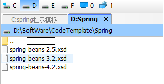
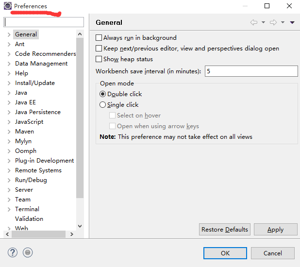
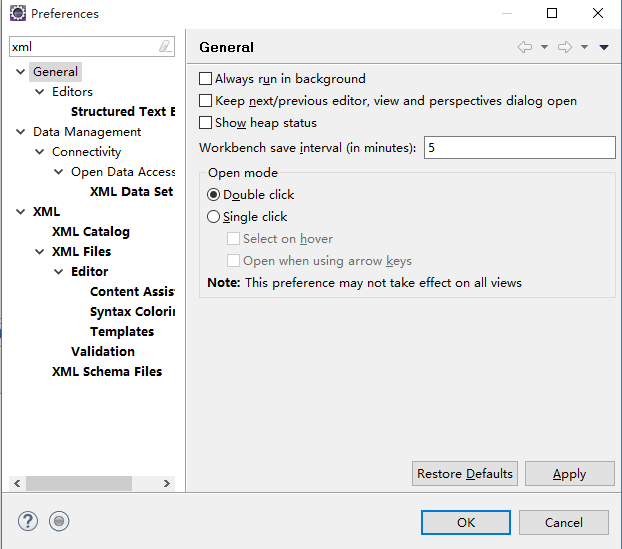
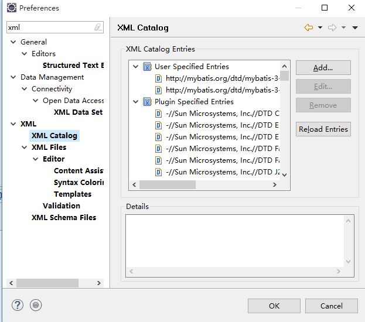
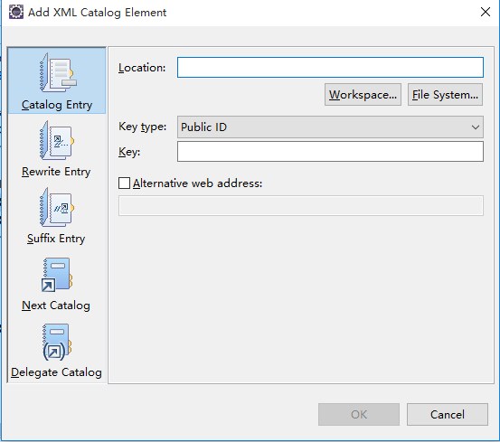
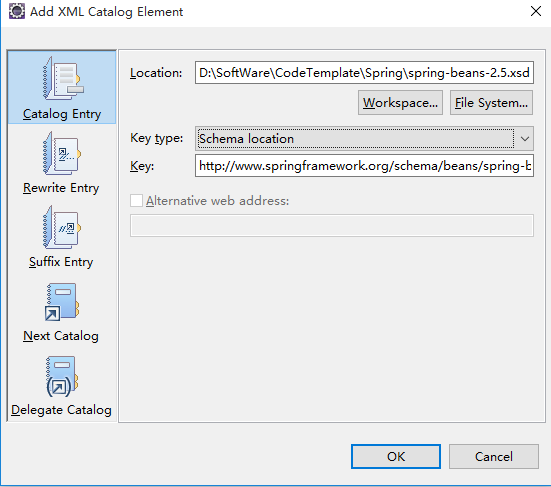

# 1 配置Spring框架提示模板

将Spring框架提示模板文件放置在D:\SoftWare\CodeTemplate\Spring文件夹下：

  

在eclipse中点选“Window —— > Preferences”，弹出如下窗口：

 

在该Preferences窗口的搜索框中输入“xml”进行查询搜索：

点选“XML”目录下的“XML Catalog”菜单项：

点击窗口右侧的“Add”按钮：

在Location输入框中输入本地的提示模板文件地址，在Key输入框中输入：

    http://www.springframework.org/schema/beans/spring-beans-2.5.xsd

在Key type下拉选项中选择“Schema location”：

最后点击按钮“OK”完成配置。