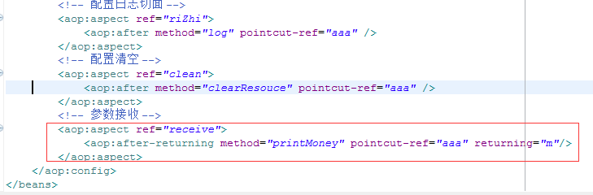
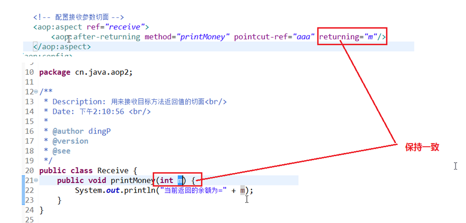

## 9.6 后置通知接收参数

在包com.marshal.aop1中创建类Receive

	package com.marshal.aop1;
	
	public class Receive {
		
		public void printMoney(int m){
			System.out.println("当前返回的余额= " + m);
		}
	}

将该类织入aop局部配置文件中

 

将连接点函数getMoney()修改为具有返回值的函数

	public int getMoney() {
    	
        System.out.println("BankServiceImpl.........getMoney().........余额为500万");
        return 500;
    }

简单执行测试：

	Security..........isSecurity().......环境安全
	BankServiceImpl.........getMoney().........余额为500万
	当前返回的余额= 500
	Clean..........clearResouce().........数据已经清空
	RiZhi..........log().........记录日志

 

现在如果调用没有返回值的连接点函数时

	package com.marshal.aop1;
	
	import org.springframework.context.ApplicationContext;
	import org.springframework.context.support.ClassPathXmlApplicationContext;
	
	public class Window {
	
	    public static void main(String[] args) {
	
	        ApplicationContext context = new ClassPathXmlApplicationContext("applicationContext.xml");
	        BankServiceImpl bsi = (BankServiceImpl) context.getBean("bankServiceImpl");
	//        bsi.getMoney();
	        bsi.zhuanMoney();
	    }
	}

测试结果为

	Security..........isSecurity().......环境安全
	BankServiceImpl.........zhuanMoney().........转账100万
	Clean..........clearResouce().........数据已经清空
	RiZhi..........log().........记录日志

通过结果可以看出，当被织入的连接点没有返回值的时候，程序就不会调用接收参数的后置通知。

如果将切入点函数zhuanMoney()的返回值设置成String类型

	public String zhuanMoney() {
    	
        System.out.println("BankServiceImpl.........zhuanMoney().........转账100万");
        return "哈哈";
    }

将接受通知函数的接收参数类型修改为Object

	package com.marshal.aop1;
	
	public class Receive {
		
		public void printMoney(Object m){
			System.out.println("当前返回的余额= " + m);
		}
	}

测试运行结果为

Security..........isSecurity().......环境安全
BankServiceImpl.........zhuanMoney().........转账100万
当前返回的余额= 哈哈
Clean..........clearResouce().........数据已经清空
RiZhi..........log().........记录日志

从程序运行结果证明，将接收参数的后置通知的参数设置为Object类型，便可以接收任何类型返回值连接点函数。