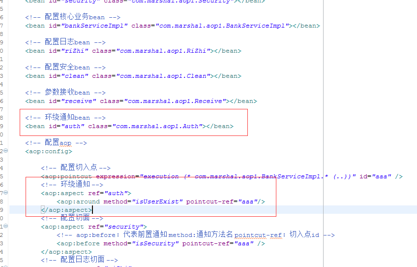

## 9.7 环绕通知

配置环绕通知切面类Auth

	package com.marshal.aop1;
	
	import org.aspectj.lang.ProceedingJoinPoint;
	
	/**
	 * 判断用户名及密码是否正确
	 * @author Steven
	 *
	 */
	public class Auth {
	
		private String username = "abc";
		private String password = "123";
				
		public void isUserExist(ProceedingJoinPoint pjp) throws Throwable{
			if("admin".equals(username) && "123".equals(password)){
			    //特殊类及方法，放行设置
				pjp.proceed();
			}else{
				System.out.println("亲，登陆错误");
			}
		}
	}

在局部配置文件中增加环绕通知

 

	<?xml version="1.0" encoding="UTF-8"?>
	<beans xmlns="http://www.springframework.org/schema/beans"
		xmlns:xsi="http://www.w3.org/2001/XMLSchema-instance" xmlns:aop="http://www.springframework.org/schema/aop"
		xmlns:context="http://www.springframework.org/schema/context"
		xsi:schemaLocation="
		http://www.springframework.org/schema/beans 
		http://www.springframework.org/schema/beans/spring-beans-4.2.xsd
		http://www.springframework.org/schema/aop 
		http://www.springframework.org/schema/aop/spring-aop-4.2.xsd
		http://www.springframework.org/schema/context 
		http://www.springframework.org/schema/context/spring-context-4.2.xsd">
	
		<!-- 配置安全bean -->
		<bean id="security" class="com.marshal.aop1.Security"></bean>
	
		<!-- 配置核心业务bean -->
		<bean id="bankServiceImpl" class="com.marshal.aop1.BankServiceImpl"></bean>
	
		<!-- 配置日志bean -->
		<bean id="riZhi" class="com.marshal.aop1.RiZhi"></bean>
	
		<!-- 配置安全bean -->
		<bean id="clean" class="com.marshal.aop1.Clean"></bean>
		
		<!-- 参数接收bean -->
		<bean id="receive" class="com.marshal.aop1.Receive"></bean>
		
		<!-- 环绕通知bean -->
		<bean id="auth" class="com.marshal.aop1.Auth"></bean>
	
		<!-- 配置aop -->
		<aop:config>
		
			<!-- 配置切入点 -->
			<aop:pointcut expression="execution (* com.marshal.aop1.BankServiceImpl.* (..))" id="aaa" />
			<!-- 环绕通知 -->
			<aop:aspect ref="auth">
				<aop:around method="isUserExist" pointcut-ref="aaa"/>
			</aop:aspect>
			<!-- 配置切面 -->
			<aop:aspect ref="security">
				<!-- aop:before：代表前置通知 method:通知方法名 pointcut-ref：切入点id -->
				<aop:before method="isSecurity" pointcut-ref="aaa" />
			</aop:aspect>
			<!-- 配置日志切面 -->
			<aop:aspect ref="riZhi">
				<aop:after method="log" pointcut-ref="aaa" />
			</aop:aspect>
			<!-- 配置清空 -->
			<aop:aspect ref="clean">
				<aop:after method="clearResouce" pointcut-ref="aaa" />
			</aop:aspect>
			<!-- 参数接收 -->
			<aop:aspect ref="receive">
				<aop:after-returning method="printMoney" pointcut-ref="aaa" returning="m"/>
			</aop:aspect>
		</aop:config>
	</beans>

执行测试

当将环绕通知函数的用户名及密码设置为错误的时候：

	package com.marshal.aop1;
	
	import org.aspectj.lang.ProceedingJoinPoint;
	
	/**
	 * 判断用户名及密码是否正确
	 * @author Steven
	 *
	 */
	public class Auth {
	
		private String username = "abc";
		private String password = "123";
				
		public void isUserExist(ProceedingJoinPoint pjp) throws Throwable{
			if("admin".equals(username) && "123".equals(password)){
				pjp.proceed();
			}else{
				System.out.println("亲，登陆错误");
			}
		}
	}

执行结果为

	八月 18, 2018 3:57:46 下午 org.springframework.context.support.ClassPathXmlApplicationContext prepareRefresh
	信息: Refreshing org.springframework.context.support.ClassPathXmlApplicationContext@37bba400: startup date [Sat Aug 18 15:57:46 CST 2018]; root of context hierarchy
	八月 18, 2018 3:57:46 下午 org.springframework.beans.factory.xml.XmlBeanDefinitionReader loadBeanDefinitions
	信息: Loading XML bean definitions from class path resource [applicationContext.xml]
	八月 18, 2018 3:57:46 下午 org.springframework.beans.factory.xml.XmlBeanDefinitionReader loadBeanDefinitions
	信息: Loading XML bean definitions from class path resource [com/marshal/aop1/aop.xml]
	亲，登陆错误

从执行结果可以看到，环绕通知不放行，其他的连接点及通知一律不执行。

当将环绕通知函数的用户名及密码设置为正确的时候：

	package com.marshal.aop1;
	
	import org.aspectj.lang.ProceedingJoinPoint;
	
	/**
	 * 判断用户名及密码是否正确
	 * @author Steven
	 *
	 */
	public class Auth {
	
		private String username = "admin";
		private String password = "123";
				
		public void isUserExist(ProceedingJoinPoint pjp) throws Throwable{
			if("admin".equals(username) && "123".equals(password)){
				pjp.proceed();
			}else{
				System.out.println("亲，登陆错误");
			}
		}
	}

执行结果为

	八月 18, 2018 4:30:50 下午 org.springframework.context.support.ClassPathXmlApplicationContext prepareRefresh
	信息: Refreshing org.springframework.context.support.ClassPathXmlApplicationContext@37bba400: startup date [Sat Aug 18 16:30:50 CST 2018]; root of context hierarchy
	八月 18, 2018 4:30:50 下午 org.springframework.beans.factory.xml.XmlBeanDefinitionReader loadBeanDefinitions
	信息: Loading XML bean definitions from class path resource [applicationContext.xml]
	八月 18, 2018 4:30:50 下午 org.springframework.beans.factory.xml.XmlBeanDefinitionReader loadBeanDefinitions
	信息: Loading XML bean definitions from class path resource [com/marshal/aop1/aop.xml]
	Security..........isSecurity().......环境安全
	BankServiceImpl.........invest().........投资100万，投资失败
	当前返回的余额= 3.14
	Clean..........clearResouce().........数据已经清空
	RiZhi..........log().........记录日志

从执行结果可以看到，环绕通知放行，其他的连接点及通知则会一律执行。